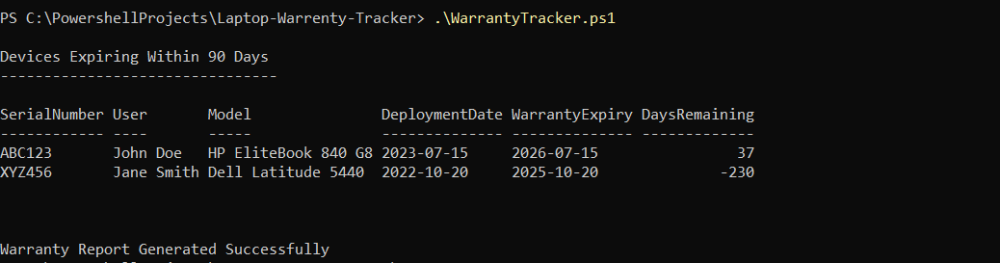

# Laptop Warranty Tracker

A PowerShell-based solution for tracking laptop warranty expiration and supporting endpoint technology refresh planning.

## Features

* Imports laptop inventory from a CSV file
* Calculates remaining warranty days
* Identifies devices approaching warranty expiration
* Generates CSV reports for asset management
* Supports proactive tech refresh planning

## Technologies Used

* PowerShell
* CSV Reporting
* Date Calculations
* PSCustomObject
* Export-Csv

## Sample Input

| SerialNumber | User       | Model               | DeploymentDate | WarrantyExpiry |
| ------------ | ---------- | ------------------- | -------------- | -------------- |
| ABC123       | John Doe   | HP EliteBook 840 G8 | 2023-07-15     | 2026-07-15     |
| XYZ456       | Jane Smith | Dell Latitude 5440  | 2022-10-20     | 2025-10-20     |

## Sample Output

Devices Expiring Within 90 Days

ABC123 - 37 Days Remaining

XYZ456 - Warranty Expired (230 Days Ago)

## Screenshot

## Future Enhancements

* Email notifications for expiring devices
* Excel report generation
* Microsoft Graph integration
* Intune device inventory integration
